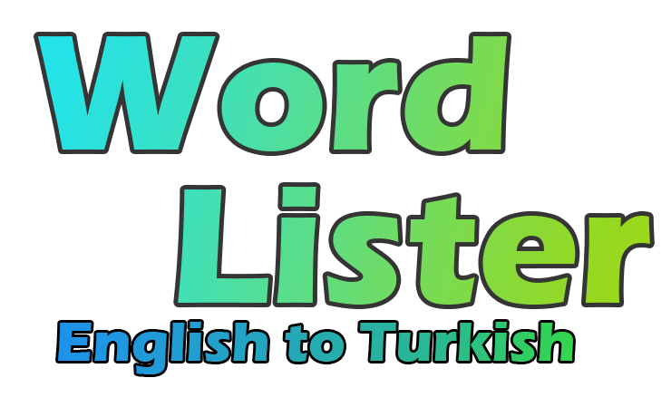

# Word Lister
<p align="center">
   
</p>

> **Live project**: https://wordlister.netlify.app/

Word listing app for english word learning.

## Used Tools
- React.js
- Node.js
- Babel
- Webpack
- axios
- Bootstrap

## Quick Installation
```
npm install
```
## Run Project
```
npm run start-wps
```

## Features
- Automatic and manual translation feature.
- Showing latest user update time.
- Word pronunciation feature for english words.
- Most searched and least searched words listing.

## License
MIT

